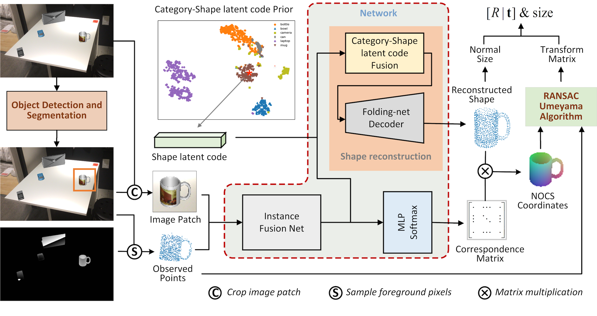

# 基于形状隐式编码的单目6D姿态估计

## Overview


- pipeline

  

## 安装依赖
```bash
pip install -r requirements.txt
```

## 安装nn_distance（加速计算Chamfer距离）
```
ROOT=/path/to/slp-net
cd $ROOT/lib/nn_distance
python setup.py install --user
```

## Datasets

- 下载

  Download [camera_train](http://download.cs.stanford.edu/orion/nocs/camera_train.zip), [camera_val](http://download.cs.stanford.edu/orion/nocs/camera_val25K.zip),[real_train](http://download.cs.stanford.edu/orion/nocs/real_train.zip), [real_test](http://download.cs.stanford.edu/orion/nocs/real_test.zip),[ground-truth annotations](http://download.cs.stanford.edu/orion/nocs/gts.zip),and [mesh models](http://download.cs.stanford.edu/orion/nocs/obj_models.zip) provided by [NOCS](https://github.com/hughw19/NOCS_CVPR2019).

- 解压

  Unzip and organize these files in $ROOT/data as follows:

  ```
  data
  ├── CAMERA
  │   ├── train
  │   └── val
  ├── Real
  │   ├── train
  │   └── test
  ├── gts
  │   ├── val
  │   └── real_test
  └── obj_models
      ├── train
      ├── val
      ├── real_train
      └── real_test
  ```

- 数据预处理

  ```
  cd $ROOT/preprocess
  python shape_data.py
  python pose_data.py
  ```

## train

- 训练点云自编码器

  ```bash
  python train_pcAE.py
  ```
  本代码默认使用FoldingNet点云自编码器，默认结果存储目录在`$ROOT/results/ae_compare/foldingnetAE`。同时也提供了论文[SPD]()中的点云编码网络，可在`train_pcAE.py`对应注释处进行更改。

- 生成类别点云形状隐式编码和类别平均形状

  ```bash
  python mean_shape.py --model=results/ae_compare/foldingnetAE/model.pth
  ```
  通过--model指定训练好的点云自编码器模型，结果默认存储在模型参数的同级目录下。将生成的`mean_points.npy`和`mean_embedding512fold.npy`复制到`$ROOT/assets`目录下，以供6D姿态估计网络训练及预测时使用。

- 训练6D姿态估计网络

  上述点云编码网络训练并非必需，此链接提供了数据集对应的类别点云形状隐式编码(`mean_embedding512fold.npy`)和类别平均形状(`mean_points.npy`)文件，可以直接下载到`$ROOT/assets`目录下，从而跳过点云编码网络的训练，直接训练6D姿态估计网络。

  ```bash
  python train.py --dataset=CAMERA --result_dir=results/slpNet_res/camera
  ```
  具体参数设置详见代码及注释说明。

## Evaluation
通过[此链接](https://cloud.189.cn/t/ZRjANjaMf63q)下载相应的文件，其中包含预训练好的模型，测试数据集对应Mask-RNN分割的结果以及NOCS和SPD的结果。并将结果解压到`$ROOT/results`目录下。

- 6D姿态估计评估
  ```
  python evaluate.py
  ```

- 点云重建评估
  ```bash
  python evaluate_shape.py
  ```

- 可视化对比
  ```bash
  python visual_com.py --result_dir=results/slpNet_res/eval_camera --compare_result_dir=results/nocs_res/val
  ```
  通过--result_dir指定待对比的预测结果目录，--compare_result_dir指定对比的结果目录。可视化结果默认存储在预测结果目录下的`visual_res_cp`子目录。

## 参考
本仓库代码参考借鉴了 [NOCS](https://github.com/hughw19/NOCS_CVPR2019)、 [object-deform](https://github.com/mentian/object-deformnet)、 [foldingNet](https://github.com/XuyangBai/FoldingNet) 和 [transformer](https://nlp.seas.harvard.edu/2018/04/03/attention.html) 的部分代码。
